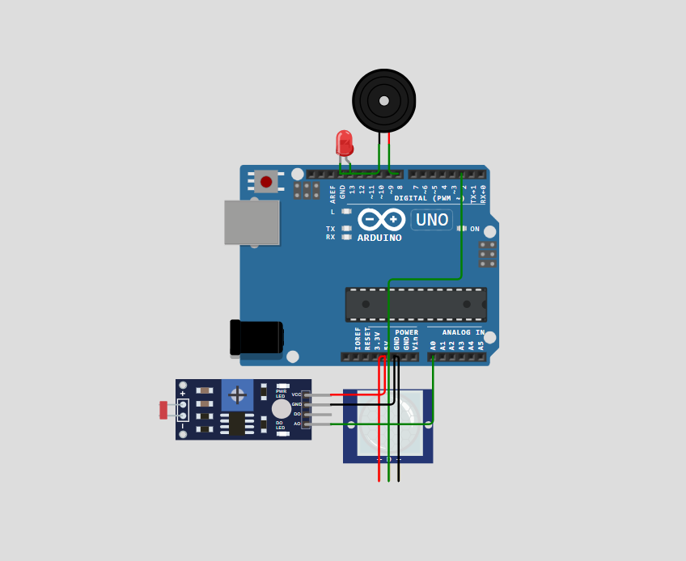
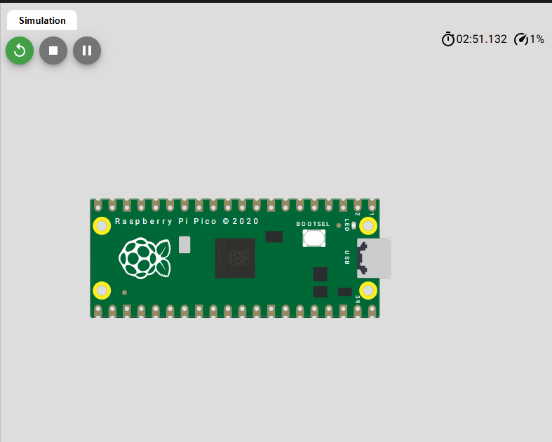

# 🏠 Smart Home Monitoring System with Arduino & ARM Architecture

An embedded systems project developed for the **Microprocessors and Microcontrollers Programming** course.

---

## 📖 About

This project implements a smart home monitoring system capable of detecting ambient light levels and motion using Arduino-based sensors.

The system continuously monitors environmental conditions and automatically activates visual and audible alerts whenever movement is detected in a dark environment, simulating a low-cost residential security solution.

Additionally, the project includes an introductory ARM-based implementation using a Raspberry Pi Pico to demonstrate embedded programming concepts beyond the Arduino platform.

📄 **Academic Paper:**
`artigo/artigo-monitoramento-residencial-arduino.pdf`

---

## ✨ Features

* Ambient light monitoring
* Motion detection
* Automatic LED activation
* Audible alarm using a buzzer
* Serial monitor output
* Real-time decision making
* Arduino simulation using Wokwi
* Introductory ARM simulation with Raspberry Pi Pico

---

## ⚙️ System Logic

The embedded application follows three operating conditions:

* 🌙 **Dark environment + Motion detected**

  * LED turns on
  * Buzzer sounds
  * Alert message is displayed

* ☀️ **Bright environment + Motion detected**

  * Motion is logged
  * No alarm is triggered

* ✅ **No motion detected**

  * System remains in a safe state

---

## 🛠️ Tech Stack

* Arduino Uno
* C/C++
* Raspberry Pi Pico
* ARM Architecture (concepts)
* Wokwi Simulator

---

## 🔌 Hardware Components

| Component   | Purpose                 |
| ----------- | ----------------------- |
| Arduino Uno | Main controller         |
| LDR Sensor  | Ambient light detection |
| PIR Sensor  | Motion detection        |
| LED         | Visual alert            |
| Buzzer      | Audible alert           |

---

## 📷 Project Preview

### Complete Circuit

### Raspberry Pi Pico (ARM)

---

## 🎥 Demonstration

📺 YouTube Demo

https://youtu.be/KiuQRioK5vM

---

## 🔗 Online Simulation

🌐 Wokwi

https://wokwi.com/projects/464364096321736705

---

## 🎯 Purpose

This project was developed to apply embedded systems concepts, sensor integration, automation logic, and introductory ARM architecture through practical simulations.

It also serves as a portfolio project demonstrating embedded programming, hardware integration, and real-time decision-making.

---

## 📄 License

This project is available for educational and portfolio purposes.
